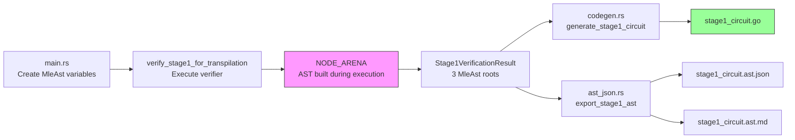

# Gnark Transpiler Prototype

Prototype transpiler for a simplified Stage 1 Jolt verifier to Gnark circuits using symbolic execution.

## 1. Symbolic Execution Approach

Static analysis of Rust code with generics, traits, and macros is complex. We use symbolic execution instead: run the code with "recording" types that build an AST.

Jolt verifier code is generic over `JoltField`:

```rust
fn verify<F: JoltField>(a: F, b: F) -> F {
    let c = a + b;
    c * a
}
```

Run with `BN254Field` → computes result
Run with `MleAst` → records operations to AST

`MleAst` implements `JoltField` but records instead of computing:

```rust
impl JoltField for MleAst {
    fn add(self, rhs: Self) -> Self {
        let node = Node::Add(self.edge(), rhs.edge());
        insert_node_to_arena(node)
    }
}
```

Nodes stored in global arena (`OnceLock<RwLock<Vec<Node>>>`), `MleAst` holds index. Execute verifier with `MleAst` → captures computation graph.

AST traversal generates Gnark code:

```rust
match node {
    Node::Add(left, right) => format!("api.Add({}, {})", generate(left), generate(right)),
    Node::Mul(left, right) => format!("api.Mul({}, {})", generate(left), generate(right)),
}
```

No parsing infrastructure needed. Stays in sync with Rust code. Only captures executed paths. Requires generic code over field types.

**No proof needed for transpilation**: The transpiler executes verifier code with symbolic variables (`MleAst`), not concrete values. We create placeholder variables (X_0, X_1, ...) and run the verifier with them. Operations get recorded as AST nodes, not computed. This is a "dry-run" that traces which operations would be executed, without needing actual proof data. The resulting AST becomes Gnark circuit code.

Adapted from zkLean (extracts Jolt to Lean 4 for formal verification).

## 2. Implementation

### Transpiler Pipeline



### Components

**`zklean-extractor/src/mle_ast.rs`** (dependency)

Provides the symbolic execution infrastructure. `MleAst` is the core type that implements `JoltField` trait. Instead of computing field operations, each operation (add, mul, sub, etc.) creates a new node in the global arena and returns a handle to it.

The arena is `OnceLock<RwLock<Vec<Node>>>` - thread-safe, lazily initialized, mutable. All AST nodes live here, referenced by index. This avoids recursive `Box<Node>` structures that cause stack overflows for deep expressions.

Node types: `Atom` (scalar constant or variable), unary ops (`Neg`, `Inv`), binary ops (`Add`, `Mul`, `Sub`, `Div`). Each node references children via `Edge` enum: either inline `Atom` or `NodeRef(usize)` pointing to arena.

**`jolt-core/src/zkvm/stage1_only_verifier.rs`** (dependency)

Contains `verify_stage1_for_transpilation()`. This is the Spartan outer sumcheck verifier, simplified: takes challenges as function parameters instead of deriving them from Fiat-Shamir transcript. Returns `Stage1VerificationResult<F>` with three components:
- `final_claim`: evaluation of polynomial at challenge point (must match expected)
- `power_sum_check`: sum of uni-skip polynomial over symmetric domain (must be 0)
- `sumcheck_consistency_checks`: vector of checks, one per round, verifying poly(0) + poly(1) = claim (all must be 0)

When called with `F = MleAst`, this function executes normally but builds computation graph instead of computing values.

**`gnark-transpiler/src/codegen.rs`**

AST traversal and code generation. `generate_gnark_expr(node_id: usize)` recursively walks the arena, matching on node type and generating corresponding Gnark API calls. Example: `Node::Add(left, right)` → `"api.Add({}, {})"` with recursive calls for children.

`generate_stage1_circuit()` takes `Stage1VerificationResult<MleAst>` and produces complete Go source file:
1. Collects all variables used across all constraints (via `generate_gnark_expr_with_vars`)
2. Generates circuit struct with one `frontend.Variable` field per input
3. Generates `Define()` method body with assertions:
   - `powerSumCheck == 0`
   - Each consistency check `== 0`
   - `finalClaim == ExpectedFinalClaim`

Output is valid Gnark circuit code, ready to compile.

**`gnark-transpiler/src/ast_json.rs`**

Export and visualization. `Stage1AstJson` is JSON-serializable representation of the full AST plus metadata. Includes:
- `nodes`: all arena nodes as `NodeJson` enum
- `constraints`: list of constraint definitions (name, description, root node ID)
- `variables`: sorted list of all variable indices used
- `trace_length`, `num_rounds`: metadata

`export_stage1_ast()` walks the result structure, finds maximum node ID needed, exports `[0..max_id]` nodes, collects variables.

`to_mermaid()` generates diagram for each constraint. Traverses from root node, renders as graph with operation nodes and leaf atoms. Used for debugging: can visually inspect computation graph structure.

**`gnark-transpiler/src/main.rs`**

CLI entry point. Hardcodes `trace_length=8` (needs to be parameter). Calculates `num_rounds = log2(trace_length) = 3`.

Creates symbolic variables sequentially:
- X_0..X_2: `tau` (num_rounds challenge points)
- X_3..X_5: `sumcheck_challenges` (num_rounds round challenges)
- X_6: `r0` (initial challenge)
- X_7..X_10: `uni_skip_poly_coeffs` (num_rounds+1 coefficients for degree-3 polynomial)
- X_11..X_16: `sumcheck_round_polys` (num_rounds polynomials × 2 coefficients each)

Constructs `Stage1VerificationData<MleAst>` with these variables. Calls `verify_stage1_for_transpilation()` → execution builds AST. Calls code generation functions. Writes three files.

**`gnark-transpiler/go/`**

Go side. `stage1_circuit.go` is generated output (example with trace_length=8). Defines `Stage1Circuit` struct with X_3..X_16 variables (note: X_0..X_2 created but not used - limitation). `Define()` method has 5 assertions: 1 power sum check, 3 consistency checks, 1 final claim check.

`example_test.go` demonstrates full pipeline: compile circuit to R1CS, setup (generate pk/vk), create witness (all zeros), prove, verify. Currently passing with trivial witness.

`witness.go` is placeholder for future witness extraction from real Jolt proofs.

### Design Rationale

**Symbolic execution**: Avoids implementing Rust parser, type resolver, trait system, macro expander. Jolt verifier code is already generic over `JoltField`. We just provide alternative implementation of that trait. Code paths that execute get captured. Dead code doesn't appear in AST.

**Stage 1 only**: Full Jolt has multiple verification stages. Stage 1 is Spartan outer sumcheck - pure polynomial arithmetic. No hash functions (Fiat-Shamir), no elliptic curve ops (polynomial commitments), no lookup tables. Simplest subset to validate approach.

**Challenges as parameters**: Real verifier computes challenges via transcript hashing (Fiat-Shamir). For circuit, we treat them as public inputs. Prover supplies challenges from their proof transcript, circuit verifies arithmetic relationships hold. Separates arithmetic verification from cryptographic derivation.

**JSON/Mermaid**: AST structure not obvious from generated code. JSON export allows inspection, potential reuse by other tools. Mermaid diagrams visualize computation graph - useful for debugging, understanding constraint structure, finding optimization opportunities.

**Go tests**: Validates generated code actually compiles with Gnark, satisfies R1CS compilation, produces valid proofs. Without this, transpiler could generate syntactically valid but semantically wrong circuits.

### Limitations

1. **Hardcoded trace_length=8** (`main.rs:67`) → 3 sumcheck rounds, 17 variables (X_0..X_16). Needs CLI arg.

2. **Stage 1 only**. Missing: inner sumcheck, polynomial commitments, lookup arguments.

3. **Simplified challenges**. No transcript/Fiat-Shamir. No hash functions.

4. **No witness extraction**. `witness.rs` is placeholder. All-zero witnesses only.

5. **Untested at scale**. trace_length=8 is toy. Real proofs: 2^16+. Unknown R1CS constraint count at scale.

6. **No optimizations**. No CSE. Naive nesting → code bloat. zkLean PR #1060 has relevant techniques.

7. **X_0, X_1, X_2 unused**. tau variables created but don't appear in constraints. Incomplete generation or unnecessary allocation.

## 3. Future Work

### Larger Traces

Current implementation hardcodes `trace_length=8`. Need to test systematically with powers of 2: 16, 32, 64, 128, 256, 512, 1024. Measure R1CS constraint count at each scale. Profile AST traversal and code generation performance. Monitor memory usage during AST construction.

Scaling issues to watch:

- **Constraint explosion**: Each sumcheck round adds consistency checks. With `trace_length=2^n`, we get `n` rounds. Need to verify constraint count scales linearly or polynomially, not exponentially.
- **Deep expression nesting**: AST nodes reference other nodes. Deep trees (10+ levels) may cause stack overflows during traversal or slow down code generation.
- **Arena size**: All nodes stored in single `Vec`. With millions of operations, arena could hit memory limits. May need pagination or incremental export.
- **Code generation time**: String concatenation for large expressions may become bottleneck. Consider using buffered writers or template engines.

If constraint count grows too fast, CSE from zkLean PR #1060 becomes necessary. That PR shows how to detect repeated subexpressions and hoist them to let-bindings, reducing both constraint count and generated code size.

### Non-Arithmetizable Components

Stage 1 verifier is pure polynomial arithmetic. Full verifier includes non-arithmetizable operations.

**Hash functions (Poseidon, SHA-256)**

Fiat-Shamir challenge derivation requires hashing. Transcript absorbs commitments, evaluations, and previous challenges, then squeezes out next challenge. Options:

1. **Circuit-friendly hashes** (Poseidon, Rescue, Reinforced Concrete)
   - Designed for low constraint count in SNARKs
   - Gnark has native Poseidon implementation
   - Still expensive: hundreds to thousands of constraints per hash
   - Would add significant circuit size

2. **Hint-based**
   - Hash computed outside circuit (native CPU execution)
   - Circuit receives preimage and digest as inputs
   - Circuit verifies `hash(preimage) == digest` using circuit-friendly hash
   - Prover can't cheat: wrong hash fails verification
   - Reduces circuit from full Fiat-Shamir to single hash verification per challenge

3. **Hybrid verification**
   - Keep transcript hashing off-circuit entirely
   - Circuit takes challenges as public inputs (current approach)
   - Separate proof verifies challenge derivation was correct
   - Requires careful security analysis: challenge derivation and arithmetic verification must compose soundly

**Polynomial commitments**

Jolt uses Dory for polynomial commitments. These involve elliptic curve operations not easily expressed as field arithmetic.

Commitment opening verification:
- Prover claims `poly(r) = v` for some evaluation point `r`
- Verifier checks commitment opening proof
- Involves multi-scalar multiplications (MSMs), pairings

Options:

1. **Native Gnark commitment schemes**
   - Gnark supports KZG, IPA (inner product argument)
   - Would need to ensure field/curve compatibility
   - Jolt uses BN254 for commitments - Gnark also supports BN254
   - May be able to reuse Gnark's native commitment verification circuits
   - Still expensive: MSM verification or pairing checks

2. **Hints** (inspired by PR #975)
   - Prover provides polynomial opening: coefficients or evaluations at specific points
   - Circuit checks polynomial evaluation at challenge point matches claimed value
   - Circuit checks poly(0) + poly(1) = previous_claim (for sumcheck)
   - Avoids commitment verification entirely
   - Much smaller: just polynomial arithmetic, not elliptic curve ops
   - Security relies on external commitment verification (outside circuit)

3. **Recursive composition**
   - Keep polynomial commitment verification in native Jolt verifier
   - Only transpile arithmetic core (sumcheck, consistency checks)
   - Circuit verifies: "given these polynomial evaluations, arithmetic checks pass"
   - Separate system verifies: "commitments open to these evaluations"
   - Two-layer proof: outer proves commitments correct, inner proves arithmetic correct

Hint-based approach most promising: Jolt's sumcheck already structured around polynomial evaluations. Circuit just needs to verify evaluation consistency, not cryptographic commitments.

### Real Jolt Proofs

Currently tests use all-zero witnesses (trivial). Need integration with actual Jolt proof generation:

- Implement witness extraction in `witness.rs`
- Capture intermediate values during proof generation
- Serialize to format Gnark can load
- Test round-trip: Jolt proves → extract witness → Gnark verifies

### Fibonacci Example

Jolt includes Fibonacci as example guest program. Transpiling full Fibonacci verification would validate the approach on complete, non-trivial computation:

- Run Jolt prover on Fibonacci guest program → generates proof
- Extract Stage 1 verification data from proof (challenges, polynomial coefficients, evaluations)
- Transpile Stage 1 verifier to Gnark circuit (already implemented)
- Create witness from Fibonacci proof data
- Verify in Gnark: prove that Stage 1 arithmetic checks pass for Fibonacci execution

This tests the full pipeline: real program → Jolt proof → transpiled circuit → Gnark verification. Fibonacci is simple enough to debug but complex enough to expose issues with witness extraction, constraint generation, and arithmetic correctness.

### Basic Arithmetic Consistency Tests

Before tackling full proofs, need unit tests for fundamental operations:

- **Field arithmetic**: Addition, multiplication, subtraction, division with known test vectors. Verify transpiled circuits compute same results as Rust implementation.
- **Polynomial evaluation**: Evaluate `p(x) = a_0 + a_1*x + a_2*x^2` at test points. Compare Rust vs Gnark outputs.
- **Sumcheck building blocks**: Test `poly(0) + poly(1) = claim` constraint with small hand-crafted polynomials. Verify circuit correctly enforces consistency.
- **Power sums**: Compute `Σ_t t^k` over small symmetric domains. Check circuit output matches closed-form formulas.

These tests establish correctness of basic operations before scaling to full verifier. Catch bugs in code generation, type conversions, or constraint encoding early.

---

## Usage

```bash
cd jolt/gnark-transpiler
cargo build --release
cargo run --release -- --output go/stage1_circuit.go

cd go
go test -v
open stage1_circuit.ast.md
```

## References

- [zkLean Runtime Introspection](runtime-introspection-explained.md)
- [zkLean PR #1060](https://github.com/a16z/jolt/pull/1060)