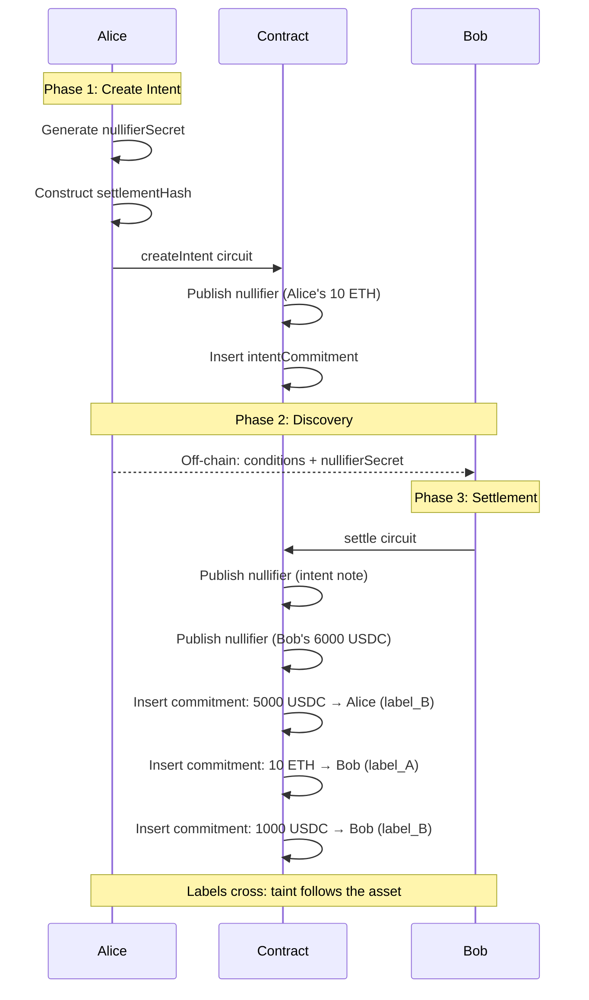

# Settlement Notes: Private Intents Without the Encryption Paradox

## Two Families of Intents

Privacy Pool v2 needs to support conditional spending — actions that execute only when certain conditions are met. There are two families:

**Public intents** are straightforward. The protocol supports hooks: external calls to arbitrary addresses with arbitrary data, triggered on deposits or transfers. The proof includes a `payloadHash` as a public signal, binding it to the transaction. The contract decodes the payload and performs the call. This enables integrations with DeFi protocols, bridges, and other on-chain logic — but the conditions and execution are visible on-chain.

**Private intents** are harder. You want conditional logic that settles privately — like in-pool swaps where neither the terms nor the parties are revealed. Public hooks can't do this because the conditions would be visible.

This document describes **Settlement Notes**, a mechanism for private conditional spending. It's the private complement to public hooks.

**Implementation note:** Settlement Notes are fully compatible with the core protocol. They're an additive extension — standard notes continue using `addressHash` + keystore-based nullifiers, the existing `transact` circuit remains unchanged, and the commitment/nullifier infrastructure is shared. Settlement Notes introduce a new note type with dedicated `createIntent`/`settle` circuits, but don't require modifying anything that already works. This can be built later without touching the core spec.

---

## The Problem: Private Swaps

The canonical example is a private swap. Alice wants to trade her ETH for Bob's USDC, all within the pool. No public orderbook, no visible transaction linking them.

The challenge: when Alice posts a limit order, she doesn't know who Bob is yet. She can't construct his output commitment — she doesn't know his label. She can't encrypt the note secrets for him — she doesn't know his keys.

Previous attempts at solving this hit the same wall. The "Encryption Paradox" forces either (a) both parties to be online simultaneously for a handshake, or (b) a trusted relayer who sees both sides' secrets. Neither works for non-interactive limit orders with real privacy.

Settlement Notes solve this by creating an intermediate note type that anyone can settle — if they satisfy the conditions and know a secret. The swap example is used throughout this document, but the pattern generalizes: different settlement circuits can enforce different conditional actions (time-locks, price conditions, multi-party escrows, etc.).

---

## The Core Heuristics

Before diving into mechanics, here are the three key design moves that make this work:

### Heuristic 1: Replace `ownerAddressHash` with `settlementDataHash`

In a standard note, the commitment structure includes an `addressHash` that binds the note to its owner:

```
addressHash = Poseidon(ownerAddress, noteSecret)
commitment = Poseidon(addressHash, tokenId, value, label)
```

Settlement notes replace `addressHash` with a hash of the settlement terms:

```
settlementHash = Poseidon(tokenOut, minAmountOut, makerAddressHash, nullifierSecret, ...)
commitment = Poseidon(settlementHash, tokenId, value, label)
```

The note is no longer "owned" by an address. It's "owned" by whoever can satisfy the conditions encoded in `settlementHash`.

### Heuristic 2: Replace keystore nullifier with single-use secret

Standard notes derive their nullifier from the owner's keystore:

```
nullifier = Poseidon(privateNullifyingKey, commitment)
```

This requires a keystore lookup — the spender must prove their `nullifyingKeyHash` is registered for the note's `ownerAddress`. This is what creates the dependency on knowing the owner in advance.

Settlement notes use a **single-use nullifier secret** instead:

```
nullifier = Poseidon(nullifierSecret, commitment)
```

The `nullifierSecret` is generated fresh when the intent is created. Whoever knows it can nullify the note — no keystore involved. It's the same pattern Tornado Cash uses, but scoped to a single intermediate note rather than the whole system.

### Heuristic 3: Conditions are verified, not enforced by ownership

In normal spending, ownership *is* the authorization. If you can prove you own the note, you can spend it however you want.

Settlement notes separate authorization from ownership. The `settlementHash` encodes conditions (what token, what amount, where the maker's output goes). The settle circuit verifies these conditions are satisfied — it's not enough to just know the `nullifierSecret`.

This is what makes the note "conditional": the nullifier secret grants the *ability* to spend, but the circuit enforces *how* it can be spent.

---

## Why These Heuristics Solve the Problem

The Encryption Paradox exists because standard note ownership requires knowing the recipient at creation time. You need their `ownerAddress` to construct the commitment.

Settlement notes break this in two ways:

1. **The maker doesn't construct the taker's output.** The taker constructs their own output when they settle. The maker just specifies conditions.

2. **Authorization doesn't require keystore lookup.** The `nullifierSecret` is shareable. Alice generates it, shares it with potential settlers, and whoever settles uses it directly.

The `nullifierSecret` is the linchpin. It's the one piece of secret data that gets shared, and it's *designed* to be shared — unlike `privateNullifyingKey` which must never leave the owner's control.

---

## The Flow: Creating and Settling



### Alice Creates an Intent

Alice has 10 ETH (label_A) and wants at least 5000 USDC.

1. She generates a fresh `nullifierSecret`
2. She constructs settlement conditions: `{tokenOut: USDC, minAmountOut: 5000, aliceAddressHash, nullifierSecret}`
3. She runs the `createIntent` circuit:
   - Spends her 10 ETH note (nullifies it with her keystore key)
   - Creates an intent note with `settlementHash` instead of `addressHash`
   - The intent note carries her original label (label_A)

The intent note is now in the commitment tree. It's not owned by anyone in the traditional sense — it's "owned" by whoever knows the conditions and the `nullifierSecret`.

### Bob Discovers and Settles

Bob has 6000 USDC (label_B) and wants ETH.

Through some announcement mechanism (more on this later), Bob learns:
- The settlement conditions
- The `nullifierSecret`
- Enough data to reconstruct the intent commitment

Bob runs the `settle` circuit:
- Proves the intent note exists in the tree (reconstructs commitment from conditions)
- Proves his 6000 USDC note exists and satisfies the conditions (≥ 5000 USDC)
- Nullifies the intent note using `nullifierSecret`
- Nullifies his own note using his keystore `privateNullifyingKey`
- Creates outputs:
  - Alice: 5000 USDC with **label_B** (Bob's label — taint follows the asset)
  - Bob: 10 ETH with **label_A** (Alice's label)
  - Bob: 1000 USDC change with **label_B** (his own label)

One transaction. Atomic. Both sides exchange or neither does.

### Alice Can Cancel

What if nobody fills Alice's order? She can settle with herself:
- Run the `settle` circuit as both maker and taker
- Recover her 10 ETH (possibly to a new label via the existing `forkLabel` mechanism if desired)

This uses the same `nullifierSecret` she generated — she doesn't need anyone else's cooperation.

---

## Why Other Approaches Don't Work

Private swaps in UTXO systems have been tried before. The approaches fall into two categories, and both have fundamental limitations:

**Approach A: Both parties construct proofs independently, match on-chain.**

Alice creates a proof spending her note, Bob creates a proof spending his, and a contract matches them. The problem: Alice needs to construct her output commitment (the USDC she'll receive) when she creates her proof. But she doesn't know Bob's label yet — and label is part of the commitment. She can't build it.

You could try having Alice leave a "template" that gets filled in later, but then the filling-in requires someone who knows both sides' data. Which leads to...

**Approach B: A relayer sees both sides and builds the proof.**

If neither party can construct the other's output, have a third party do it. The relayer collects Alice's and Bob's secrets, builds a combined proof, and submits it. This works mechanically, but the relayer learns everything — values, labels, owners. You've traded privacy for functionality.

**What Settlement Notes change:**

The core move is decoupling the nullifier from the keystore. In standard notes, only the owner can nullify (via their `privateNullifyingKey`). This creates the dependency: whoever settles needs to interact with Alice's ownership somehow.

Settlement notes use a fresh `nullifierSecret` instead. It's generated specifically to be shared. Bob doesn't need to know anything about Alice's keystore — he just needs the secret she gave him. And since the conditions are encoded in `settlementHash`, the circuit can verify Bob satisfies them without anyone learning Alice's original note secrets.

---

## Label Handling: Taint Follows the Asset

When Alice's ETH and Bob's USDC exchange hands, what happens to the labels?

The answer must be: **labels cross**. Alice receives Bob's label. Bob receives Alice's label.

This is the only compliance-correct approach. The USDC that Alice receives came from Bob's deposit lineage. If Bob's original deposit is later flagged as illicit, Alice's USDC is affected — because it *is* those funds, regardless of who now holds them.

Both parties accept counterparty risk when they swap. Alice might end up with tainted USDC. Bob might end up with tainted ETH. This is true of any exchange, private or not.

The intent note itself carries Alice's original label. If her label is revoked while the intent is pending, she can cancel and recover funds. If it's settled before revocation, the label propagates normally to Bob's output.

---

## Multi-Note Settlements

Real swaps aren't always exact.

**Bob has more than needed:**
Bob brings 6000 USDC, Alice only wants 5000. The circuit creates:
- 5000 USDC to Alice (label_B)
- 10 ETH to Bob (label_A)
- 1000 USDC change to Bob (label_B)

Value conservation holds. Labels are preserved.

**Bob uses multiple notes:**
Bob might have his USDC spread across notes with different labels:
- 3000 USDC (label_B1)
- 2500 USDC (label_B2)

Per-label conservation means Alice must receive separate outputs:
- 3000 USDC to Alice (label_B1)
- 2000 USDC to Alice (label_B2)

The circuit handles this by supporting multiple inputs and multiple outputs per party. More complex, but necessary for a real system where users accumulate fragmented notes.

---

## The Announcement Problem

Alice has created an intent. Bob needs to find it. How?

This is the hardest part of the design, and it's fundamentally a tradeoff between discoverability and privacy.

### What Bob Needs to Know

To settle, Bob needs:
1. The settlement conditions (what Alice wants)
2. Alice's `addressHash` (to construct her output)
3. The `nullifierSecret` (to nullify the intent)
4. Enough data to reconstruct the intent commitment (for inclusion proof)

Items 1-2 define the order. Items 3-4 authorize settlement.

### Single-Stage Communication (Simpler, Less Private)

The simplest approach: Alice publishes everything publicly.

- Settlement conditions: token pair, exact amounts, price
- Alice's `addressHash` (pseudonymous, but fixed per account)
- The `nullifierSecret`

Anyone can see "someone wants to swap 10 ETH for 5000 USDC." First valid settler wins.

**What's leaked:** The swap terms are fully public. Observers can see the order, watch it get filled, and potentially correlate Alice's `addressHash` across multiple orders. If Alice uses the same address repeatedly, her trading patterns become visible.

**When this is acceptable:** Public orderbooks, price discovery mechanisms, situations where the trading activity itself isn't sensitive. Many DeFi users already accept this level of transparency.

### Two-Stage Communication (More Private, More Complex)

For users who need to hide their trading activity, separate discovery from authorization:

**Stage 1: Public Announcement (Obfuscated)**

Alice publishes:
- Token pair (ETH → USDC)
- Rough price range (maybe)
- An intent identifier (hash of conditions, not the conditions themselves)

This goes to some orderbook — could be on-chain events, could be a P2P gossip network, could be a centralized matching service. The key point: observers see "someone wants to swap ETH for USDC" but not the amounts, not Alice's identity, not anything that lets them reconstruct the commitment.

**Stage 2: Private Negotiation**

Bob sees the announcement and expresses interest. Through encrypted communication (using viewing keys, or a dedicated ephemeral keypair):
- Alice sends Bob the full conditions + `nullifierSecret`
- Bob verifies he can satisfy the conditions
- Bob settles

If Bob doesn't settle (timeout, changed mind, or malicious spy), Alice cancels and recreates with a fresh `nullifierSecret`.

### The Spy Problem

What if an attacker:
1. Expresses interest in Alice's order
2. Receives her conditions + `nullifierSecret`
3. Never settles, just watches to see who does

The spy now knows Alice's intent details. When settlement eventually happens, they can link Alice to the settlement transaction.

**Mitigation: On-chain rotation**

If a potential settler doesn't complete within a reasonable window, Alice cancels the intent (on-chain) and creates a new one with a fresh `nullifierSecret`. The spy's knowledge becomes useless — that intent no longer exists.

This is expensive. Every rotation is an on-chain transaction. But the alternative — allowing unbounded sharing of `nullifierSecret` — would be insecure. The secret must be bound in the commitment, which means rotation requires recreating the commitment.

The hope is this is rare. Most settlements complete on the first match. Spies are a minority. And the cost of rotation (one cancel + one create) is bearable for the security it provides.

---

## The Circuits

### `createIntent` Circuit

**Public Inputs:**
- `commitmentRoot` (note existence)
- `keyRegistryRoot` (ownership)
- `nullifierHash` (for Alice's input note)
- `intentCommitment` (the new intent note)
- `conditionsHash` (binds to settlement terms)

**Private Inputs:**
- Alice's input note secrets
- Alice's keystore keys
- Settlement conditions (tokenOut, minAmountOut, etc.)
- `nullifierSecret`
- Alice's `addressHash`

**Assertions:**
1. Input note exists and is owned by Alice
2. `intentCommitment` correctly constructed from conditions
3. `conditionsHash` binds to the conditions
4. Value conservation (input value = intent note value)
5. Label propagates to intent note

### `settle` Circuit

**Public Inputs:**
- `commitmentRoot`, `keyRegistryRoot`, `associationSetRoot`
- Intent nullifier (from `nullifierSecret`)
- Bob's input nullifier(s) (from his keystore key)
- Output commitments (Alice's output(s), Bob's output(s), Bob's change)
- `conditionsHash`

**Private Inputs:**
- Intent note data (conditions, `nullifierSecret`, Alice's `addressHash`)
- Bob's input note(s) secrets
- Bob's keystore keys
- Output details (values, labels, recipients)

**Assertions:**
1. Intent note exists (reconstruct commitment, verify inclusion)
2. Intent nullifier = Poseidon(`nullifierSecret`, intentCommitment)
3. Bob's notes exist and are owned by Bob
4. Bob's notes satisfy conditions (correct token, sufficient amount)
5. Per-label value conservation for all labels involved
6. Alice's output(s) go to her `addressHash` with correct labels
7. Bob's outputs go to his `addressHash` with correct labels
8. ASP compliance for all input labels

### Cancel / Rotate

There's no separate `cancelIntent` circuit — cancellation is just Alice settling with herself. She runs the `settle` circuit as both maker and taker:
- Nullifies the intent note (using `nullifierSecret`)
- Creates a standard note back to herself

This is also how rotation works: cancel the current intent, then create a new one with a fresh `nullifierSecret`. Same mechanism, different intent afterward.

---

## Open Questions

**Announcement protocol details.** The two-stage communication is sketched but not specified. What's the transport? How does Bob find Alice's encrypted channel? This might need its own design doc.

**Partial fills.** Can Bob fill only part of Alice's order? Would require Alice to create a smaller new intent with the remaining amount. More UX complexity.

**Expiry.** Should intents have a time-bound? Block number in conditions that the settle circuit checks?

**Multiple concurrent offers.** Can Alice share `nullifierSecret` with multiple potential settlers, first-to-settle wins? Dangerous — a spy who doesn't settle still holds valid data. Probably better to stick with sequential offers and rotation.

**Other settlement types.** This document focuses on swaps, but the pattern generalizes. Time-locked spending, price-conditional execution, multi-party escrows — each would need its own settlement circuit with appropriate condition verification. The core heuristics (settlementHash instead of addressHash, single-use nullifier secret, condition verification in circuit) remain the same.

---

## Summary

Settlement Notes solve the private intent problem by introducing a new note type bound to conditions + a one-time nullifier secret, rather than an owner. This breaks the encryption paradox: Alice doesn't need to know Bob when she creates the intent. She just specifies what she wants and generates a secret to share later.

The tradeoffs are real:
- Two-stage communication requires Alice to be online for negotiation
- Spy protection requires on-chain rotation if settlers fail
- Labels must cross (counterparty taint risk)

But the wins are significant:
- True non-interactive settlement after the handshake
- No relayer sees secrets
- Atomic execution with full compliance integration

It's less convenient than a trusted relayer. But it's actually private.
