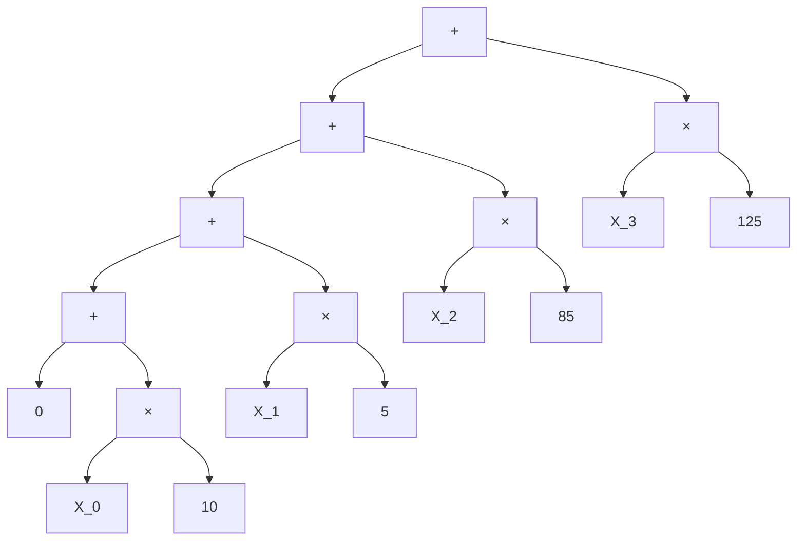
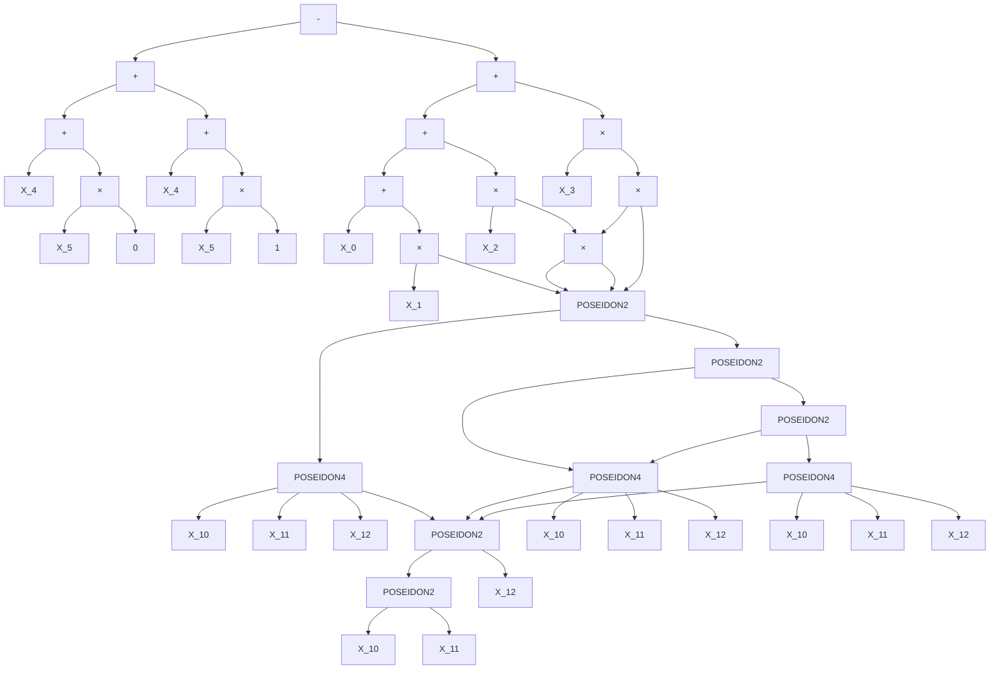
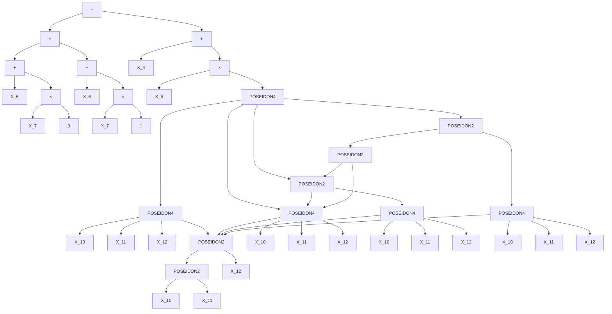
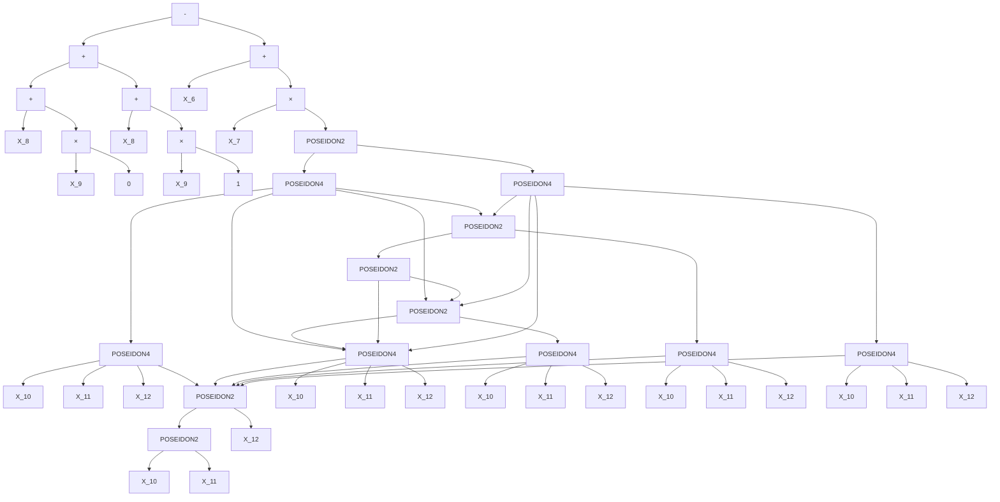
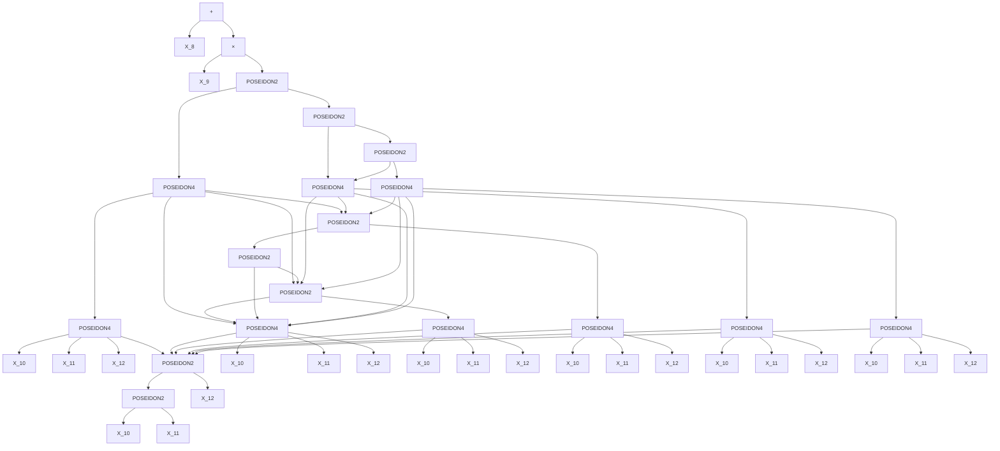

## power_sum_check

Sum over symmetric domain must equal 0

## consistency_check_0

Sumcheck round 0: poly(0) + poly(1) - claim == 0

## consistency_check_1

Sumcheck round 1: poly(0) + poly(1) - claim == 0

## consistency_check_2

Sumcheck round 2: poly(0) + poly(1) - claim == 0

## final_claim

Final claim must match expected value

